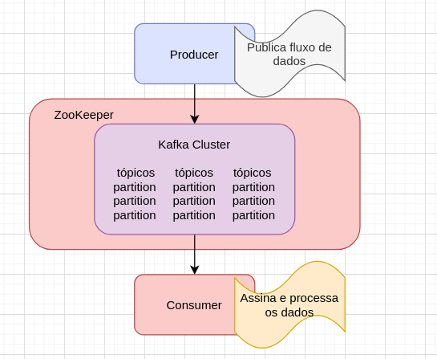

# Primeiros Passos com Apache Kafka + Nodejs

## Introdução

Segundo a Wiki *"Apache Kafka é uma plataforma open-source de processamento de streams desenvolvida pela Apache Software Foundation, escrita em Scala e Java. O projeto tem como objetivo fornecer uma plataforma unificada, de alta capacidade e baixa latência para tratamento de dados em tempo real"*.

Pode ser usado em diversos cenarios, um desses é utilização em microservices onde voce distribui sua aplicação, geralmente por dominio. Neste caso o Apache Kafka é a cereja do bolo, com ele suas aplicações podem ser facilmente escaladas horizontalmente.

## Iniciando a Aplicação

Instalando Dependências

> yarn

Subindo instancia do Apache Kafka
> docker-compose up -d

Rodando a aplicação
> yarn run dev

## Fluxo Producer e Subscribe

Como é visto no fluxo acima, vamos analisar os passos.

1 - Producer publica fluxo de dados.

2 - Kafka recebe os dados através de um tópico que é assinado por algum consumer.

3 - Consumer recupera e processa os dados de um ou mais tópicos.

## Referências

* [Kafka](https://kafka.apache.org/)
* [Kafka JS](https://kafka.js.org/)
* [Docker](https://docs.docker.com/)
* [Node](https://nodejs.org/en/)